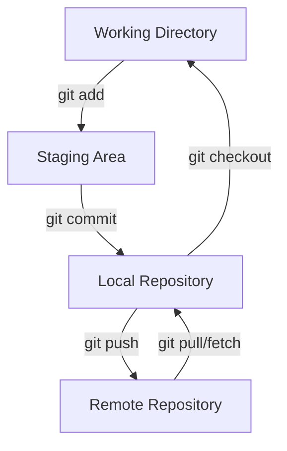
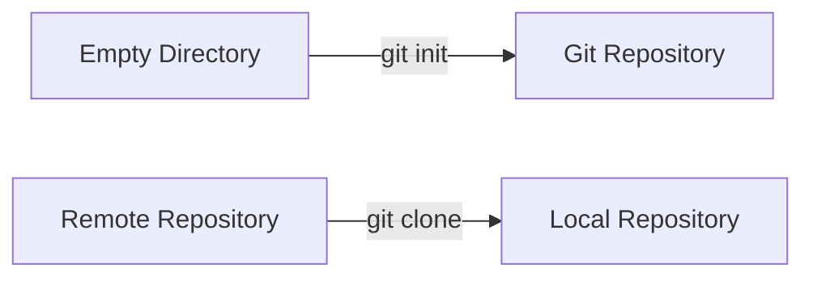
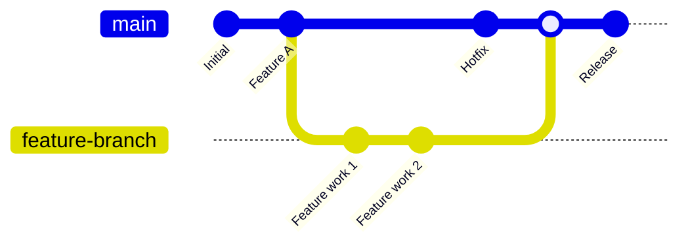
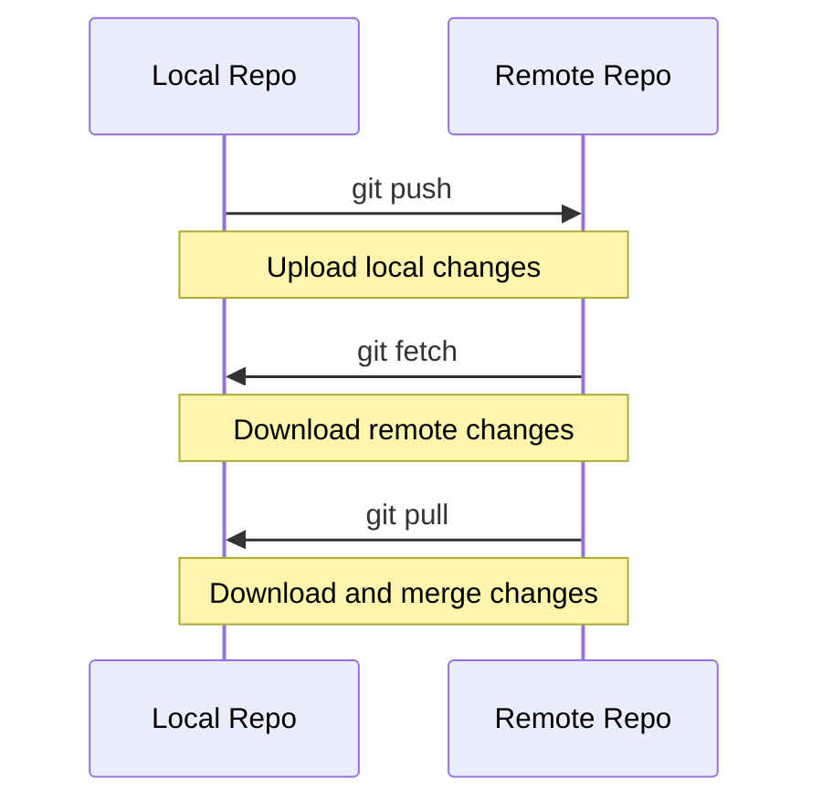
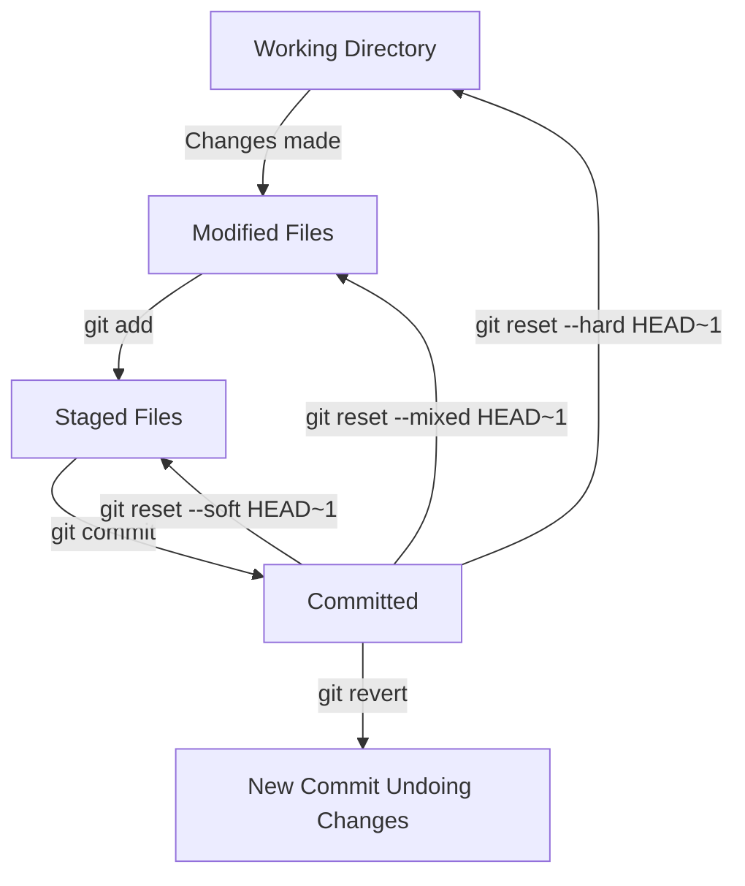
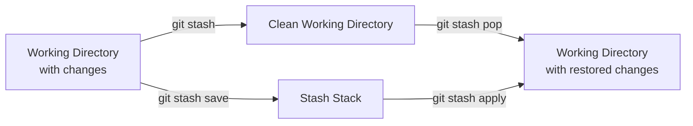
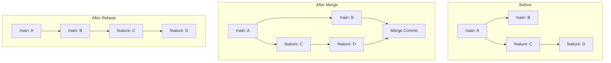
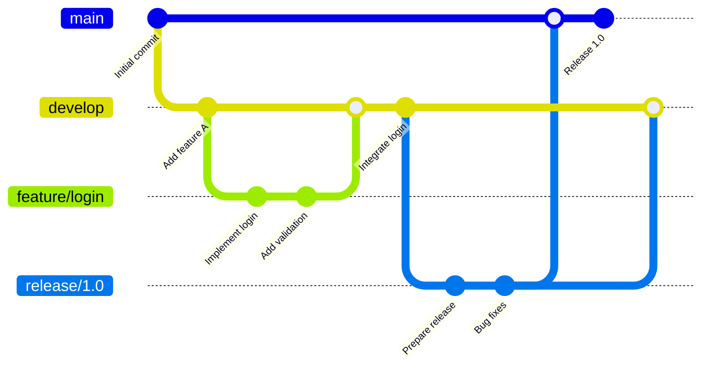
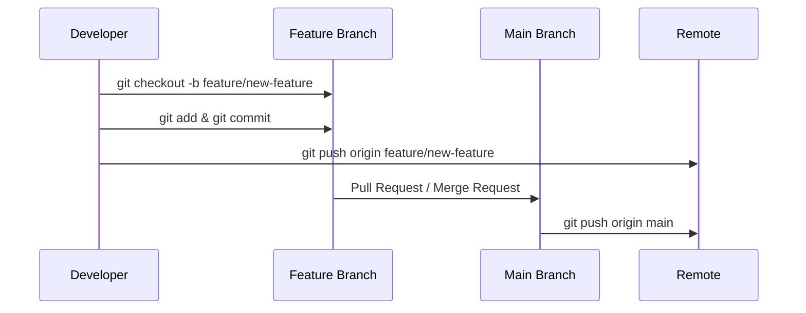
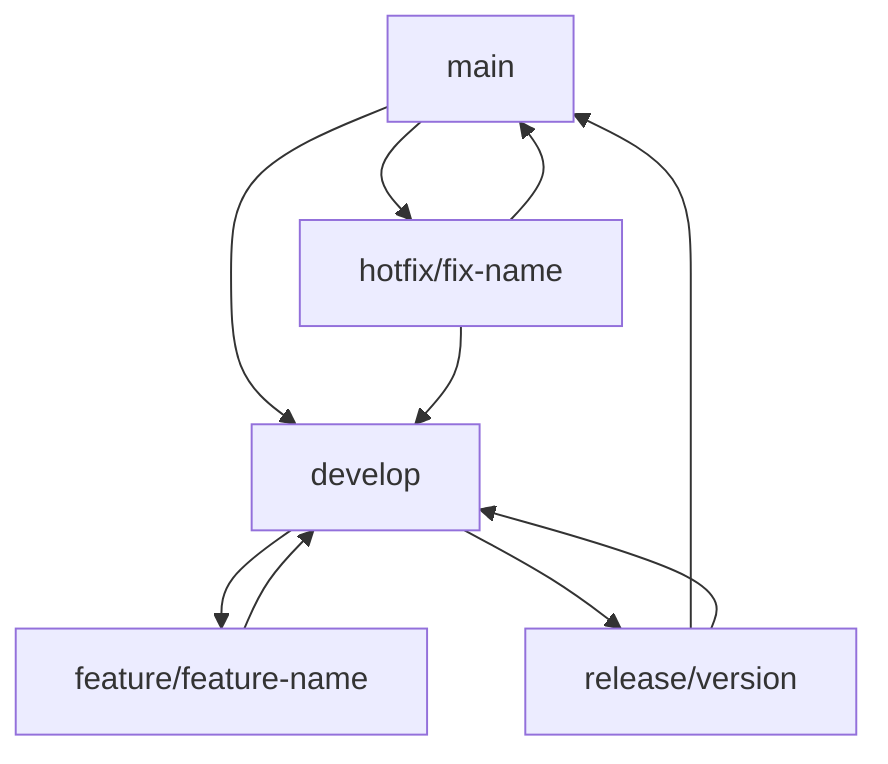

# Git Commands Guide with Visual Diagrams

This guide covers essential Git commands with visual diagrams to help you understand Git workflows better.

## Git Workflow Overview



## Basic Git Commands

### 1. Repository Initialization

```bash
# Initialize a new Git repository
git init

# Clone an existing repository
git clone <repository-url>
```



### 2. Basic Workflow Commands

```bash
# Check repository status
git status

# Add files to staging area
git add <file-name>
git add .                # Add all files
git add *.js            # Add all JavaScript files

# Commit changes
git commit -m "commit message"
git commit -am "message"  # Add and commit in one step

# View commit history
git log
git log --oneline       # Compact view
git log --graph         # Visual graph
```

## Branching and Merging

### Branch Operations

```bash
# List branches
git branch              # Local branches
git branch -r           # Remote branches
git branch -a           # All branches

# Create new branch
git branch <branch-name>

# Switch to branch
git checkout <branch-name>
git switch <branch-name>  # Modern alternative

# Create and switch to new branch
git checkout -b <branch-name>
git switch -c <branch-name>

# Delete branch
git branch -d <branch-name>    # Safe delete
git branch -D <branch-name>    # Force delete
```

### Branching Workflow Diagram



### Merging

```bash
# Merge branch into current branch
git merge <branch-name>

# Merge with no fast-forward (creates merge commit)
git merge --no-ff <branch-name>

# Abort merge in case of conflicts
git merge --abort
```

## Remote Repository Operations

```bash
# Add remote repository
git remote add origin <repository-url>

# View remote repositories
git remote -v

# Push to remote
git push origin <branch-name>
git push -u origin <branch-name>  # Set upstream

# Pull from remote
git pull origin <branch-name>
git pull                          # From tracked branch

# Fetch from remote (without merging)
git fetch origin
```

### Remote Workflow Diagram



## Undoing Changes

### Working Directory and Staging

```bash
# Discard changes in working directory
git checkout -- <file-name>
git restore <file-name>           # Modern alternative

# Unstage files
git reset HEAD <file-name>
git restore --staged <file-name>  # Modern alternative

# Discard all local changes
git reset --hard HEAD
```

### Commit History

```bash
# Undo last commit (keep changes in working directory)
git reset --soft HEAD~1

# Undo last commit (keep changes in staging area)
git reset --mixed HEAD~1

# Undo last commit (discard all changes)
git reset --hard HEAD~1

# Create new commit that undoes previous commit
git revert <commit-hash>
```

### Undo Operations Diagram



## Stashing

```bash
# Stash current changes
git stash
git stash save "work in progress"

# List stashes
git stash list

# Apply most recent stash
git stash apply
git stash pop              # Apply and remove from stash

# Apply specific stash
git stash apply stash@{2}

# Drop stash
git stash drop stash@{0}

# Clear all stashes
git stash clear
```

### Stashing Workflow



## Advanced Commands

### Rebasing

```bash
# Rebase current branch onto another branch
git rebase <base-branch>

# Interactive rebase (last 3 commits)
git rebase -i HEAD~3

# Continue rebase after resolving conflicts
git rebase --continue

# Abort rebase
git rebase --abort
```

### Cherry-picking

```bash
# Apply specific commit to current branch
git cherry-pick <commit-hash>

# Cherry-pick multiple commits
git cherry-pick <commit1> <commit2>
```

### Rebase vs Merge Diagram



## Git Configuration

```bash
# Set global user information
git config --global user.name "Your Name"
git config --global user.email "your.email@example.com"

# Set local user information (for current repo only)
git config user.name "Your Name"
git config user.email "your.email@example.com"

# View configuration
git config --list
git config user.name

# Set default editor
git config --global core.editor "code --wait"  # VS Code
git config --global core.editor "vim"          # Vim
```

## Useful Git Aliases

```bash
# Set up useful aliases
git config --global alias.st status
git config --global alias.co checkout
git config --global alias.br branch
git config --global alias.ci commit
git config --global alias.unstage 'reset HEAD --'
git config --global alias.last 'log -1 HEAD'
git config --global alias.visual '!gitk'
```

## Git Flow Diagram



## Common Git Workflows

### Feature Branch Workflow



### Gitflow Workflow



## Troubleshooting Common Issues

### Merge Conflicts

```bash
# When merge conflicts occur:
# 1. Edit conflicted files manually
# 2. Add resolved files
git add <resolved-file>
# 3. Complete the merge
git commit
```

### Accidentally Committed to Wrong Branch

```bash
# Move last commit to correct branch
git log --oneline -n 5          # Find commit hash
git checkout correct-branch
git cherry-pick <commit-hash>
git checkout wrong-branch
git reset --hard HEAD~1         # Remove commit from wrong branch
```

### Forgot to Add Files to Last Commit

```bash
# Add forgotten files to last commit
git add <forgotten-file>
git commit --amend --no-edit
```

## Best Practices

1. **Commit Messages**: Use clear, descriptive commit messages
   ```
   feat: add user authentication
   fix: resolve login validation bug
   docs: update API documentation
   ```

2. **Branch Naming**: Use descriptive branch names
   ```
   feature/user-authentication
   bugfix/login-validation
   hotfix/security-patch
   ```

3. **Frequent Commits**: Make small, focused commits
4. **Pull Before Push**: Always pull latest changes before pushing
5. **Use .gitignore**: Exclude unnecessary files from version control

This guide covers the most commonly used Git commands with visual diagrams to help you understand the Git workflow better. Practice these commands to become proficient with Git!
